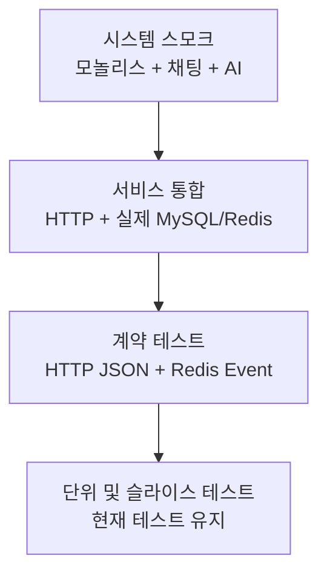
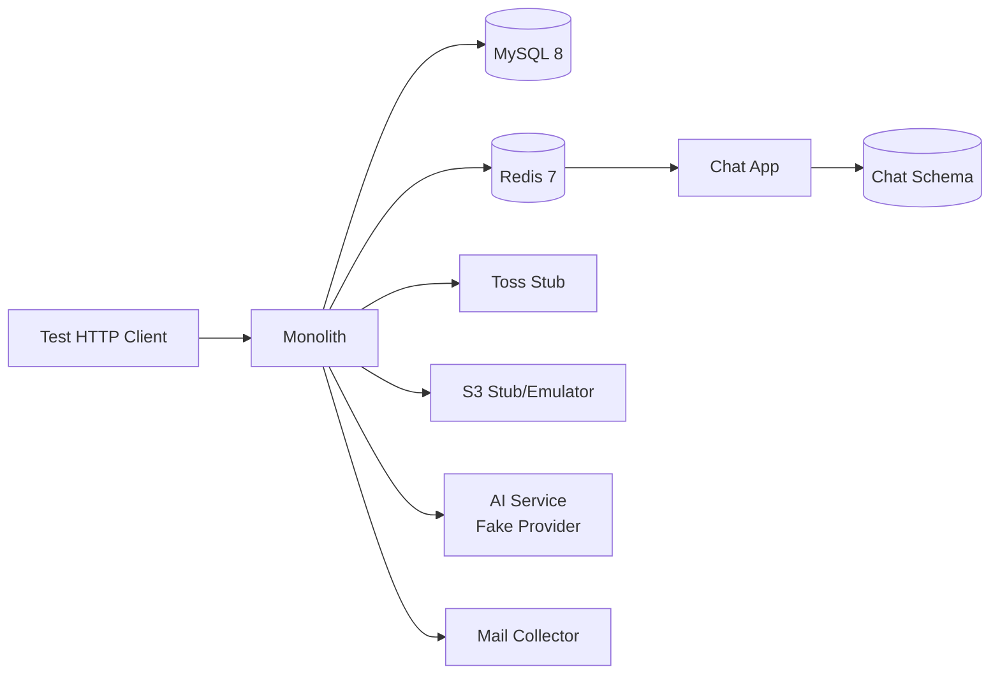

# 통합 테스트 설계

## 1. 목표

이 문서는 아직 개발 중인 ITer의 통합 테스트를 점진적으로 추가하기 위한 기준이다.

통합 테스트의 목표는 다음 네 가지다.

1. 구현이 완료된 모든 도메인 기능을 사용자 흐름 기준으로 연결해 프로젝트 전체가 동작하는지 검증한다.
2. HTTP 요청부터 데이터베이스 반영까지 실제 애플리케이션 구성이 함께 동작하는지 검증한다.
3. 모놀리스, 채팅, AI 서비스 사이의 HTTP 및 Redis 계약이 서로 호환되는지 검증한다.
4. 결제, 대여 상태 전이, 동시성처럼 장애 비용이 큰 흐름을 실제 MySQL과 Redis에서 검증한다.

통합 테스트는 특정 PR만 검사하기 위한 테스트가 아니다. 로컬 개발, 정기 검증, 배포 전 검증에서 동일한 전체 테스트 묶음을 실행한다. PR에서는 필요에 따라 일부를 빠른 피드백 용도로 실행할 수 있지만, 그것이 통합 테스트의 범위를 결정하지 않는다.

구현이 끝나지 않은 기능은 실행 가능한 테스트로 미리 만들지 않는다. 시나리오 목록에서 `PLANNED`로 관리하고, API와 도메인 규칙이 합의된 뒤 `READY`, 자동화가 끝난 뒤 `AUTOMATED`로 바꾼다.

## 2. 현재 상태와 보완할 지점

현재 저장소에는 단위 테스트, MVC/WebFlux 슬라이스 테스트, JPA 테스트, `@SpringBootTest`가 이미 충분히 있다. 새 통합 테스트는 이 테스트들을 중복하지 않고 다음 빈 곳을 채운다.

| 영역 | 현재 상태 | 보완할 지점 |
| --- | --- | --- |
| 모놀리스 | 실제 MySQL/Redis를 사용하는 독립 `integrationTest` 태스크와 HTTP 거래 흐름이 있음 | 완성되는 P1 도메인 흐름을 순차 추가 |
| 대여 동시성 | MySQL에서 겹치는 대여와 상호 대여 경합을 검증 | 반복 실행과 장시간 부하 검증은 정기 테스트에 추가 필요 |
| 채팅 | Testcontainers 기반 MySQL/Redis 통합 테스트와 서비스 간 시스템 테스트가 있음 | WebSocket 재연결·정책 위반과 Redis 이벤트 소비 회귀를 지속 확인 |
| AI 서비스 | Fake provider 통합 테스트와 Spring/Python 공용 계약 fixture가 있음 | 실제 MySQL과 Spring에서 AI까지의 시스템 흐름 필요 |
| CI | Gradle 빌드, JVM 계약, Python 전체 테스트, 모놀리스·채팅 통합 테스트, 서비스 간 스모크 테스트를 실행 | Docker 환경에서 전체 실행 결과를 지속 확인 |
| 스키마 | 빈 MySQL에서 Flyway 전체 적용 후 Hibernate `validate`를 수행 | 새 migration이 추가될 때 회귀 유지 |

## 3. 테스트 계층



### 3.1 서비스 통합 테스트

한 애플리케이션을 실제 Spring/FastAPI 구성으로 띄우고 우리 코드가 소유한 저장소까지 검증한다.

- 모놀리스: 실제 MySQL과 Redis, HTTP 요청, 인증/인가, 트랜잭션, 이벤트 리스너를 포함한다.
- 채팅: 실제 MySQL과 Redis, REST/WebSocket 요청, Redis Stream 소비를 포함한다.
- AI: 실제 MySQL과 Fake provider, 내부 인증, 작업 생성과 조회를 포함한다.
- Toss, Kakao, OpenAI, 운영 S3, SMTP는 테스트 대역을 사용한다. 외부 서비스의 가용성이 프로젝트 통합 테스트 결과를 좌우하지 않게 한다.
- API 응답만 확인하지 않고 DB 상태, Redis 레코드, 발행된 요청 등 해당 시나리오의 최종 결과를 확인한다.

### 3.2 계약 테스트

서비스를 모두 띄우지 않고 생산자와 소비자가 공유하는 데이터 형식을 양쪽에서 검증한다.

- Spring AI 요청 DTO와 Python `JobRequest`가 같은 JSON fixture를 읽는다.
- Python AI 응답 fixture를 Spring DTO가 역직렬화한다.
- `PaymentConfirmedIntegrationEvent` fixture를 모놀리스 발행자와 채팅 소비자가 함께 검증한다.
- 필수 필드, enum, 날짜 형식, null 허용 여부와 하위 호환성을 검사한다.
- fixture는 한 곳에서 관리하며 소비자별 복사본을 만들지 않는다.

### 3.3 시스템 스모크 테스트

모놀리스, 채팅, AI, MySQL, Redis를 실제 프로세스로 띄우고 서비스 사이 연결이 되는지만 소수의 시나리오로 확인한다. 모든 상세 규칙을 이 계층에서 반복 검증하지 않는다.

서비스 사이의 핵심 연결은 다음 세 흐름으로 검증한다.

1. 결제 확정 이벤트가 Redis Stream을 지나 채팅방을 `TRADE` 단계로 변경한다.
2. 모놀리스가 발급한 채팅 ticket/grant를 채팅 서비스가 소비해 문의방을 생성한다.
3. Spring이 AI 작업을 생성하고 Fake provider가 완료한 결과를 Spring API에서 조회한다.

## 4. 경계와 테스트 대역 정책



| 경계 | 서비스 통합 테스트 | 전체 시스템 테스트 | 이유 |
| --- | --- | --- | --- |
| MySQL 8 | Testcontainers 실물 | 실물 | SQL, 락, 인덱스, Flyway 검증 대상 |
| Redis 7 | Testcontainers 실물 | 실물 | TTL, Stream, consumer group, Pub/Sub 검증 대상 |
| Toss HTTP | 로컬 HTTP stub | 로컬 HTTP stub | 요청 본문, 인증, 멱등키와 오류 변환만 검증 |
| AI HTTP | stub 또는 별도 Fake provider 프로세스 | Fake provider 프로세스 | OpenAI 호출 없이 서비스 간 계약 검증 |
| S3 | 저장소 adapter 테스트는 emulator, 일반 흐름은 stub | 필요 시 emulator | presigned URL과 메타데이터 확인에만 실물 API가 필요 |
| SMTP | in-memory collector | in-memory collector | 메일 전송 결과를 결정적으로 검증 |
| Kakao OAuth | HTTP/session stub | 제외 | 외부 로그인 서비스 상태를 테스트 결과에서 분리 |

외부 서비스 대역은 성공 응답만 반환하지 않는다. 결제 승인 거부, 타임아웃, AI `409`, 잘못된 응답, Redis 재처리 같은 실패를 명시적으로 만들 수 있어야 한다.

## 5. 프로젝트 전체 검증 범위

도메인별 단위 테스트 개수와 관계없이 아래 연결 지점은 최소 한 번 이상 통합 시나리오에 포함한다.

| 영역 | 프로젝트 통합 테스트 범위 |
| --- | --- |
| 인증·회원 | 회원가입, 로그인, token refresh/logout, 주소, 탈퇴, 정지 회원 차단 |
| 장비 | 등록, 이미지 연결, 조회·검색, 대여 가능 기간, 상태 변경·삭제 |
| 대여 | 생성, 결제 후 요청, 승인·거절·취소, 배송, 수령, 반납, 완료, 리뷰, 기간 충돌 |
| 결제 | 준비, 승인, 실패, 재시도 멱등성, 취소·환불, webhook, 결제 내역 |
| 배송 | 배송 정보 등록과 대여 상태 전이 연결 |
| 알림 | 도메인 event의 커밋 이후 저장, 미읽음 수, 읽음 처리, SSE 전달 |
| 신고·관리자 | 신고 생성·조회·상태 변경, 관리자 권한, 감사 기록 |
| 채팅 | grant와 ticket, 방 생성, REST 조회, WebSocket 메시지, 읽음, 정책 위반, 결제 event 소비 |
| AI | 장비 초안, 상태 비교, 신고 분석, 중복 job, retry·복구, Spring/Python 계약 |
| 공통 인프라 | 보안 filter, 오류 응답, Flyway, MySQL 제약·락, Redis TTL/Stream, S3 adapter |

누락 여부는 이 표를 기준으로 판단한다. 아직 구현되지 않은 항목은 시나리오 상태를 `PLANNED`로 유지하며, 구현된 영역은 최소 한 개 이상의 정상 흐름과 핵심 실패 흐름을 자동화한다.

### 5.1 시나리오 상태

상태 값은 `PLANNED`, `READY`, `AUTOMATED`, `QUARANTINED` 중 하나를 사용한다. `QUARANTINED`는 연결된 이슈와 해제 기한이 있을 때만 허용한다.

### 5.2 P0: 전체 프로젝트의 핵심 흐름

| ID | 시나리오 | 주요 검증 | 상태 |
| --- | --- | --- | --- |
| IT-SCHEMA-001 | 빈 MySQL에 모놀리스 Flyway 전체 적용 | 마이그레이션 성공, Hibernate `validate` 성공 | AUTOMATED |
| IT-AUTH-001 | 로그인 → access token 인증 → refresh 회전 → logout | 이전 refresh 재사용 거절, 쿠키 삭제, DB 토큰 상태 | AUTOMATED |
| IT-RENT-001 | 장비 조회 → 대여 생성 → 결제 준비/승인 → 소유자 승인 | `PENDING → REQUESTED → APPROVED`, 결제 `PAID`, 예약 점유, 알림 저장 | AUTOMATED |
| IT-RENT-002 | 같은 장비와 겹치는 기간에 동시 대여 생성 | 정확히 1건 성공, 나머지는 기간 충돌, 점유 1건 | AUTOMATED |
| IT-RENT-003 | 서로의 장비를 동시에 대여 | MySQL 데드락 없이 둘 다 성공 | AUTOMATED |
| IT-PAY-001 | 같은 결제 승인 요청 재시도 | 같은 멱등키 사용, 결제/이벤트/알림 중복 없음 | AUTOMATED |
| IT-PAY-002 | Toss 승인 실패 | 결제 실패 기록, 대여 상태와 점유의 일관성, 5xx/도메인 오류 매핑 | AUTOMATED |
| IT-CHAT-001 | 모놀리스 결제 이벤트 → Redis Stream → 채팅 소비 | 기존 문의방이 `TRADE`, `rentalId` 저장, ACK 완료 | AUTOMATED |
| IT-AI-CONTRACT-001 | Spring 요청 fixture를 Python 계약이 수용 | 필드명, feature type, UUID, 길이 제한 일치 | AUTOMATED |
| IT-AI-001 | Spring 작업 생성 → AI Fake 처리 → 결과 조회 | 비동기 상태 전이, 결과 저장, 내부 API 인증 | AUTOMATED |

### 5.3 P1: 도메인별 전체 기능

| ID | 시나리오 | 주요 검증 | 초기 상태 |
| --- | --- | --- | --- |
| IT-RENT-010 | 승인 → 배송 → 수령 → 대여 → 반납 요청 → 반납 확인 → 쌍방 후기 | 전체 상태 전이, 역할별 권한, 배송·증빙 저장, 점유 해제, 후기 중복 방지 | AUTOMATED |
| IT-RENT-011 | 승인 전 취소와 결제 후 거절 | 환불, 점유 해제, 알림의 커밋 이후 생성 | AUTOMATED |
| IT-RENT-012 | 반납 이상 신고로 분쟁 전환 | `DISPUTED`, 분쟁·신고의 원자적 저장, 점유 유지와 중복 방지 | AUTOMATED |
| IT-AUTH-010 | 계정 상태 변경 후 인증 세션 정책 | 정지 회원의 신규 로그인·refresh 차단과 기존 거래 접근 유지, 탈퇴 회원 전면 차단 | AUTOMATED |
| IT-DEVICE-001 | 장비 등록 → 이미지 연결 → 공개 조회·검색 | 소유권, 이미지 순서, 검색 조건, MySQL 저장 상태 | AUTOMATED |
| IT-DEVICE-002 | 대여 중인 장비의 상태 변경·삭제 시도 | 도메인 제약과 기간 점유 일관성 | AUTOMATED |
| IT-PAY-010 | Toss webhook 재전송과 위조 값 처리 | 재조회 검증, 중복 event 없음, 알 수 없는 주문 무시 | AUTOMATED |
| IT-CHAT-010 | 공유 Redis grant/ticket → 채팅방 생성 | Redis TTL, grant 일회성, 참여자 권한 | AUTOMATED |
| IT-CHAT-011 | 두 WebSocket 세션 간 메시지 송수신과 재접속 | DB 저장, 순서, 중복 없음, 읽음 위치 | AUTOMATED |
| IT-CHAT-012 | 정책 위반 메시지 처리 | 마스킹, 위반 누적, 방 전송 제한 | AUTOMATED |
| IT-CHAT-013 | 모놀리스 grant/ticket 발급 → 채팅방 생성 | 두 서비스 사이 발급·소비 계약을 실제 HTTP로 검증 | AUTOMATED |
| IT-CHAT-014 | 반복 위반 관리자 이벤트 | 관리자 검토 큐 발행과 소비 | PLANNED |
| IT-NOTI-001 | 도메인 이벤트 커밋 후 알림 생성과 SSE 전달 | 롤백 시 알림 없음, 읽음/미읽음 수 일치 | AUTOMATED |
| IT-AI-010 | 같은 job ID와 같은 입력 재요청 | 기존 작업 반환, 중복 실행 없음 | AUTOMATED |
| IT-AI-011 | 같은 job ID와 다른 입력 재요청 | `409 Conflict`, 기존 결과 보존 | AUTOMATED |
| IT-AI-012 | 처리 중 재시작과 retry | `PROCESSING → PENDING` 복구 후 한 번 완료 | AUTOMATED |
| IT-AI-013 | 반납 분쟁 신고의 AI 분석 요청 | 분쟁 자료 기반 작업 생성과 결과 연결 | AUTOMATED |
| IT-ADMIN-001 | 신고 조회와 상태 변경 | 관리자 권한, 감사 로그, 상태 전이 | AUTOMATED |
| IT-STORAGE-001 | presigned 업로드 발급 → 객체 확인 → 도메인 이미지 연결 | key 소유권, 만료·재사용 제한, S3 응답 스텁과 DB 연결 | AUTOMATED |
| IT-STORAGE-002 | 실제 객체 업로드와 미사용 객체 정리 | 업로드 후 조회, 만료 객체 정리 | PLANNED |

P1 시나리오는 구현 상태에 따라 `READY`로 올린다. API가 없거나 정책이 확정되지 않은 시나리오를 `@Disabled` 테스트로 만들지 않는다.

`IT-RENT-010/012`는 실제 HTTP·MySQL·Redis 흐름을 사용한다. 수령·반납 사진은 발급된 업로드 기록을 DB에 준비하고 S3 `HEAD` 응답만 고정한다. 장비 이미지의 presign·연결은 `IT-STORAGE-001`, 실제 객체 업로드는 `IT-STORAGE-002`, 분쟁의 AI 분석은 `IT-AI-013`에서 별도로 검증한다.

`IT-STORAGE-001`은 실제 presigned URL을 로컬에서 서명하지만 S3 객체의 HEAD/바이트 응답은 스텁한다. 실제 객체 저장소와 정리 작업은 `IT-STORAGE-002` 범위다. `IT-CHAT-010`은 공유 Redis 자료형을 채팅 서비스에 준비한다. 모놀리스 발급 API와 채팅 소비 API의 연결은 `IT-CHAT-013`에서 검증한다.

## 6. 권장 디렉터리와 태스크

테스트 파일이 많아질 것을 고려해 기본 `test` 소스셋과 분리한다.

```text
apps/monolith/
  src/integrationTest/java/com/example/iter/
    support/
      MonolithIntegrationTest.java
      TestDataFactory.java
      DatabaseCleaner.java
      TossStub.java
    auth/
    rental/
    payment/
    schema/

apps/chat/
  src/test/kotlin/com/example/iter/chat/
    support/
    api/
    event/
    websocket/

ai-service/
  tests/
    contract/
    integration/

integration-tests/
  contracts/
    ai/jobs/
    events/
  system/
    compose.yml
    run.py
    test_system_smoke.py
```

Gradle에는 다음 태스크를 둔다.

- `test`: 빠른 단위 및 슬라이스 테스트
- `integrationTest`: 앱 하나와 실제 인프라를 쓰는 통합 테스트
- `contractTest`: 공용 fixture 기반 계약 테스트
- `systemTest`: 여러 앱을 프로세스로 띄우는 소수의 스모크 테스트
- `projectIntegrationTest`: 현재 모놀리스와 채팅의 JVM 통합 테스트를 한 번에 실행하는 루트 태스크. 이후 AI 실행 환경을 연결한다.

현재 채팅의 `src/test` + `@Tag("integration")` 방식은 바로 동작하므로 유지할 수 있다. 통합 테스트가 늘어날 때 `src/integrationTest`로 옮긴다. 모놀리스는 처음부터 별도 소스셋을 사용해 H2 테스트와 MySQL 테스트의 설정 충돌을 막는다.

현재 구현된 JVM 통합 테스트 실행 명령은 다음과 같다.

```powershell
.\gradlew.bat :apps:monolith:integrationTest
.\gradlew.bat projectIntegrationTest
.\gradlew.bat contractTest
cd ai-service
.\.venv\Scripts\python.exe -m pytest
cd ..
.\ai-service\.venv\Scripts\python.exe integration-tests\system\run.py
```

## 7. 공통 테스트 기반 규칙

### 7.1 컨테이너와 애플리케이션

- MySQL과 Redis 컨테이너는 테스트 메서드마다 만들지 않는다. 모놀리스는 테스트 컨텍스트에서 공유하고, 채팅은 클래스별 컨테이너를 사용하며 클래스 종료 시 Spring 컨텍스트도 닫는다.
- Spring Boot의 `@ServiceConnection`으로 주소를 주입하고 고정 포트에 의존하지 않는다.
- 통합 프로필은 `ddl-auto=create-drop`을 사용하지 않는다. Flyway를 켜고 `ddl-auto=validate`를 사용한다.
- 모놀리스와 채팅은 각각 `iter`, `iter_chat` 스키마만 접근한다. 테스트에서도 교차 스키마 조회를 금지한다.
- HTTP 시나리오는 `RANDOM_PORT`로 실행해 필터, 직렬화, 예외 처리, 보안 구성을 포함한다.

### 7.2 데이터 격리

- HTTP와 비동기 이벤트 테스트에 `@Transactional` 롤백을 사용하지 않는다. 서버 스레드와 이벤트 리스너의 트랜잭션이 테스트 스레드와 다르기 때문이다.
- 각 테스트 전에 외래 키 순서를 아는 `DatabaseCleaner`로 데이터를 비운다. 스키마를 매번 다시 만들지는 않는다.
- fixture는 도메인별 builder를 사용하고 테스트는 필요한 값만 덮어쓴다.
- 이메일, order ID, job ID는 테스트별로 고유하게 만든다. 시간 의존 규칙은 주입 가능한 `Clock`으로 고정한다.
- 검증은 API 응답과 최종 저장 상태를 함께 본다. ORM 영속성 컨텍스트의 캐시를 피하기 위해 필요하면 clear 후 재조회한다.

### 7.3 비동기 검증

- Redis Stream, SSE, AI job은 고정 `sleep`을 사용하지 않는다.
- 제한 시간 안에서 결과 조건을 폴링하고, 실패 시 마지막 상태와 관련 레코드를 출력한다.
- 이벤트 소비 테스트는 처리 결과뿐 아니라 pending/ACK 상태와 중복 전달 시 멱등성도 확인한다.
- 비동기 테스트의 기본 제한 시간은 로컬과 CI에서 같게 시작하고, 실제 측정 후 조정한다.

### 7.4 단언 범위

JSON 전체 문자열이나 모든 응답 필드를 스냅샷으로 고정하지 않는다. 다음처럼 계약과 비즈니스 불변식을 단언한다.

- HTTP 상태, 오류 코드, 필수 응답 필드
- 허용된 상태 전이와 최종 DB 상태
- 중복 레코드가 없다는 고유성
- 인가되지 않은 사용자의 데이터 변경이 없다는 사실
- 외부 stub이 받은 경로, 필수 헤더, 멱등키와 핵심 본문

표시 문구, 정렬과 무관한 JSON 순서, 생성 시각의 정확한 값처럼 자주 바뀌는 세부 사항은 핵심 계약이 아니면 고정하지 않는다.

## 8. 시나리오 작성 형식

각 테스트는 하나의 비즈니스 결과를 표현한다. 클래스명에는 시나리오 ID를 넣지 않아도 되지만 `@DisplayName` 또는 주석에 ID를 남겨 추적할 수 있게 한다.

```text
Given
  활성 소유자와 대여자, 대여 가능한 장비가 있고
  Toss stub이 결제 승인을 반환한다.
When
  대여자가 대여를 생성하고 결제를 승인한다.
Then
  결제는 PAID, 대여는 REQUESTED이며
  장비 기간 점유는 한 건이고
  소유자 알림은 트랜잭션 커밋 뒤 한 건 생성되며
  Redis Stream에는 결제 확정 이벤트가 한 건 존재한다.
```

테스트 준비를 위해 서비스 메서드를 직접 호출하면 HTTP, 보안, 직렬화 문제를 놓친다. 해당 시나리오가 API 흐름을 검증한다면 준비 데이터만 repository/factory로 만들고 행위는 HTTP로 수행한다.

## 9. 실행 전략

### 전체 프로젝트 통합 검증

1. `./gradlew test`
2. `pytest tests/contract tests/unit`
3. `./gradlew integrationTest contractTest`
4. `pytest tests/integration`
5. `systemTest`

위 묶음이 프로젝트 전체 통합 테스트의 기준 명령이다. 구현이 완료된 `AUTOMATED` 시나리오는 도메인과 실행 시간에 관계없이 모두 포함한다. 정기 실행과 배포 전 검증에서는 항상 전체 묶음을 실행한다.

### 개발 중 빠른 실행

개발자는 변경 중인 앱이나 도메인의 `integrationTest`만 선택해 실행할 수 있다. 선택 실행은 피드백 시간을 줄이기 위한 방법이며 전체 검증을 대체하지 않는다.

실행 시간이 긴 다음 항목은 정기 실행과 배포 전 검증에 포함한다.

1. 반복 동시성 테스트
2. Redis 소비자 재시작과 중복 전달
3. AI 작업 복구
4. 모든 앱을 함께 띄우는 시스템 흐름

PR에서 전체 또는 일부를 실행할지는 팀의 CI 시간에 따라 결정한다. 테스트 리포트는 단위 테스트와 통합 테스트를 구분한다. 통합 테스트 커버리지를 기존 80% 단위 테스트 수치에 단순 합산하지 않고, 도메인별 시나리오 자동화 현황을 별도로 본다.

## 10. 변경에 대응하는 운영 규칙

기능을 추가하거나 수정할 때는 다음 순서로 통합 테스트 영향을 판단한다.

1. 외부 공개 API, 서비스 간 DTO, Redis event, DB migration이 바뀌면 계약 테스트를 먼저 갱신한다.
2. 기존 비즈니스 불변식이 유지되면 기존 시나리오는 그대로 두고 fixture/DSL만 수정한다.
3. 새로운 상태 전이나 실패 방식이 생기면 시나리오 ID를 추가한다.
4. 아직 구현되지 않은 기능은 목록의 상태만 `PLANNED`로 유지한다.
5. 구현이 완료된 기능은 `READY → AUTOMATED`로 바꾸고 테스트를 추가한다.
6. 삭제된 기능의 시나리오는 이유와 대체 시나리오를 기록한 뒤 제거한다.

테스트가 제품 내부 클래스 구조를 따라가면 리팩터링 때 대량 수정이 생긴다. HTTP client, fixture builder, 외부 stub, 결과 조회 helper를 `support`에 두고 시나리오는 사용자 행위와 결과만 표현한다.

## 11. 도입 순서

### 1단계: 기반과 실제 DB 검증

- 모놀리스 `integrationTest` 소스셋과 Testcontainers 의존성 추가
- 공용 MySQL/Redis 컨테이너, `DatabaseCleaner`, 인증 client, 테스트 데이터 factory 추가
- `IT-SCHEMA-001`, `IT-RENT-002`, `IT-RENT-003`을 실제 MySQL로 이관
- AI Python 테스트를 CI에 추가

현재 구현 완료. 로컬의 Docker/WSL 엔진이 정상 기동해야 실제 컨테이너 실행까지 확인할 수 있다.

### 2단계: 거래 핵심 흐름

- Toss HTTP stub을 주입할 수 있도록 결제 client base URL 구성화
- `IT-AUTH-001`, `IT-RENT-001`, `IT-PAY-001`, `IT-PAY-002` 구현
- 커밋 이후 알림과 Redis 이벤트까지 최종 상태 검증

현재 구현 완료. 회원 인증부터 결제 후 대여 요청과 소유자 승인까지 HTTP 기반으로 자동화되어 있다.

### 3단계: 서비스 간 계약과 스모크

- AI 및 Redis 이벤트 fixture를 `integration-tests/contracts`로 이동
- Spring과 Python 양쪽 계약 테스트 연결
- 모놀리스, 채팅, AI를 함께 띄우는 시스템 스모크 테스트 추가

현재 구현 완료. 공용 AI fixture를 양쪽에서 읽고, 시스템 러너가 실제 프로세스로 결제 이벤트의 채팅 반영과 Spring-AI Fake 왕복을 검증한다.

### 4단계: 완성되는 기능을 순차 자동화

- P1 목록에서 구현이 끝난 흐름을 `READY`로 변경
- 장애 비용과 변경 빈도를 기준으로 자동화 순서를 정함
- 불안정 테스트는 무기한 재시도하지 않고 원인 이슈와 해제 기한을 기록

## 12. 첫 구현 범위

첫 구현 단계에서는 테스트 수보다 실행 기반을 안정시키는 데 집중한다.

권장 범위는 다음과 같다.

1. 모놀리스용 실제 MySQL/Redis 통합 테스트 태스크
2. 빈 MySQL Flyway 검증 1개
3. 실제 MySQL 대여 경합 테스트 2개
4. Python 테스트 CI 연결

이 기반이 안정된 다음 거래 happy path와 서비스 간 시스템 스모크를 추가하면, 개발 중인 기능 변경 때문에 많은 테스트를 반복해서 고치는 일을 줄일 수 있다.
