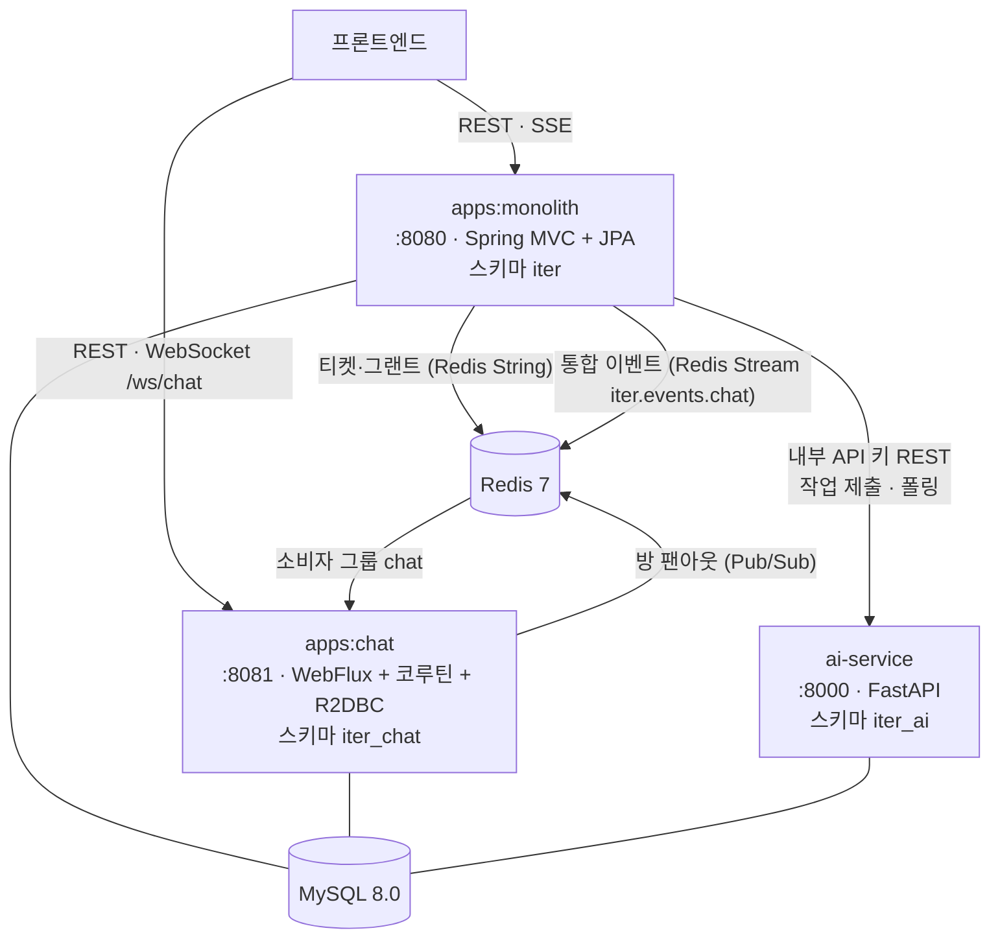

# ITer

개인 간 **장비 대여 마켓플레이스** 백엔드.

장비 등록 → 예약 → 결제(Toss) → 배송 → 사진 증빙 기반 반납 검수(AI) → 분쟁·신고 까지,
대여 한 건의 생애주기 전체를 다룹니다.


---

## 시스템 구성

프로세스는 셋입니다. 하나의 Gradle 모노레포 안에 JVM 앱 두 개와 Python 서비스 하나가 들어 있습니다.



**chat은 `iter` 스키마를 절대 조회하지 않습니다.** 물리적으로는 같은 MySQL 인스턴스지만
크로스 스키마 조인을 금지해서, 나중에 DB를 진짜로 쪼갤 때 코드를 고치지 않아도 되게 해 둔 상태입니다.
monolith가 chat에게 넘기는 건 딱 두 가지 — **인증 정보**(티켓·그랜트)와 **결제 확정 사실**(통합 이벤트)뿐입니다.

---

## 주요 기능

| 도메인 | 모듈 | 핵심 |
|---|---|---|
| 인증·회원 | `services/auth` | 이메일 가입 + 카카오 OAuth2. JWT 액세스 15분 + refresh 쿠키 14일(`__Secure-iter-refresh`), 소프트 삭제 |
| 장비 | `services/device` | 등록·검색·가격 견적, S3 presigned URL 직접 업로드, `EquipmentOccupancy`로 예약 스키마를 안 보고 가용일 응답 |
| 예약·대여 | `services/reservation` | `RentalStatusPolicy`가 지키는 13단계 상태 전이, 수령·반납 사진 증빙, 리뷰 |
| 결제 | `services/payment` | Toss 2단계(`ready` → `confirm`). 결제·취소에 각각 멱등키, 웹훅 수신 |
| 배송 | `services/delivery` | 왕복 운송장 기록. `ShippingCommandPort` 경유라 자체 컨트롤러가 없음 |
| 알림 | `services/notification` | 인앱 + SSE + 메일. `EventSource`가 헤더를 못 붙이는 문제 때문에 60초 1회용 SSE 티켓을 발급 |
| 분쟁·신고 | `services/dispute` | 신고 접수와 관리자 처리, 반납 이견 시 분쟁 생성 |
| AI | `services/ai` → `ai-service` | 장비 초안 생성 / 반납 상태 비교 / 신고 트리아지. 제출·폴링·재시도, 사용자당 일일 20건 |
| 채팅 | `apps/chat` | 결제 전 방은 연락처·계좌·외부 링크를 마스킹하고 반복 위반 시 뮤트. 결제 확정되면 정책 해제 |

**대여 상태 전이** (`services/domain-api/.../reservation/api/RentalStatus.kt`)

```
PENDING → REQUESTED → APPROVED → SHIPPING → RECEIVED → RENTING
        → RETURN_REQUESTED → RETURNING → RETURNED → COMPLETED
분기: REJECTED / CANCELED / DISPUTED
```

**비동기 처리**

- `RentalExpirationScheduler` — `@Scheduled(fixedRate = 60_000)`. 30분간 결제되지 않은 `PENDING` 대여를 자동 취소해 장비 홀드를 푼다. 유일한 스케줄러다.
- `@TransactionalEventListener(AFTER_COMMIT)` — 알림 발송 6종, 채팅 브리지 2종. 커밋 이후에만 돌아서 롤백된 트랜잭션의 알림이 나가지 않는다.
- Redis Stream `iter.events.chat` — 소비자 그룹 `chat`이 `PAYMENT_CONFIRMED` / `RENTAL_COMPLETED`를 받는다. 처리에 성공했을 때만 ACK.
- WebSocket `GET /ws/chat?roomId={id}&ticket={t}` — 원시 WebSocket이다. STOMP나 SockJS는 쓰지 않는다.

API 명세는 앱을 띄운 뒤 <http://localhost:8080/swagger-ui.html> 에서 봅니다.

---

## 모노레포 구조

```
iter/
├─ apps/                     배포 단위 (실제로 실행되는 것)
│  ├─ monolith/              메인 앱. 모든 services 를 조립하는 셸
│  └─ chat/                  독립 채팅 앱. WebFlux, 자기 스키마
│
├─ services/                 도메인 모듈 — 서로 직접 참조 금지
│  ├─ domain-api/            Port 인터페이스 + 도메인 이벤트만. 구현체 없음
│  ├─ auth/  device/  reservation/  payment/
│  ├─ delivery/  notification/  dispute/  ai/
│
├─ libs/                     공통 모듈
│  ├─ core/                  예외·페이징·Base 엔티티·로깅 필터
│  ├─ security/              JWT 발급·검증, 인증 필터
│  ├─ storage/               S3 클라이언트 설정
│  └─ event-contract/        monolith ↔ chat 이 공유하는 이벤트 DTO (Spring 의존 없음)
│
├─ build-logic/              컨벤션 플러그인 (buildSrc 아님 — includeBuild)
├─ ai-service/               Python FastAPI 서비스
├─ integration-tests/        계약 픽스처 + 시스템 스모크 compose
├─ infra/                    S3 CloudFormation 템플릿
└─ docker/                   로컬 MySQL 초기화 스크립트
```

### 지켜야 할 규칙

**1. `services/*` 끼리 직접 참조하지 않습니다.**
필요한 게 있으면 `services/domain-api`의 Port 인터페이스(`EquipmentQueryPort`, `RentalCommandPort` …)를
주입받거나 Spring 이벤트를 발행합니다. 구현체는 각 도메인이 자기 안에 어댑터로 두고,
조립은 `apps:monolith`가 합니다. 이 덕분에 도메인 간 JPA 연관관계가 0개입니다.

**2. `apps:monolith`에 도메인 로직을 넣지 않습니다.**
여기 들어가는 건 설정(`config/`), 관리자 읽기 모델(`admin/`), 채팅 브리지(`chatbridge/`),
AI 컨텍스트 어댑터(`composition/ai/`)뿐입니다.

**3. 모듈 `build.gradle`에 `repositories` 블록을 쓰면 빌드가 실패합니다.**
`settings.gradle`이 `RepositoriesMode.FAIL_ON_PROJECT_REPOS`로 저장소 선언을 한 곳에 강제합니다.

**4. 빌드 설정은 컨벤션 플러그인으로 상속받습니다.** (`build-logic/src/main/groovy/`)

```
iter.java-conventions              java-library + jacoco + 툴체인 25
  └─ iter.kotlin-conventions       Kotlin + all-open/no-arg 플러그인
  └─ iter.spring-library-conventions   + Boot BOM (Boot 플러그인은 안 붙임)
       └─ iter.spring-app-conventions  + Boot 플러그인. 실행 가능한 앱 전용
```

---

## 로컬 실행

### 0. 사전 요구

- **JDK 25** (Gradle 툴체인이 25를 요구합니다)
- **Docker** (MySQL·Redis, 통합 테스트)
- **Python 3.12+** — `ai-service`를 쓸 때만

### 1. 인프라 띄우기

```bash
docker compose up -d
```

MySQL은 3306(사용자 `root`, 비밀번호 없음), Redis는 6379로 올라옵니다.
`docker/mysql-init/001-databases.sql`이 `iter`와 `iter_chat` 스키마를 만듭니다.

> ⚠️ 이 초기화 스크립트는 **볼륨이 비어 있는 최초 부팅에만** 실행됩니다. 이미 데이터가 있으면 안 돕니다.
>
> ⚠️ `iter_ai` 스키마는 **만들어 주지 않습니다.** ai-service를 쓸 거면 직접 만드세요.
> ```bash
> docker exec -i iter-mysql mysql -uroot -e \
>   "CREATE DATABASE IF NOT EXISTS iter_ai CHARACTER SET utf8mb4 COLLATE utf8mb4_unicode_ci;"
> ```

이미 로컬에 MySQL을 직접 설치해 쓰고 있다면 compose 없이 그대로 써도 됩니다. 포트가 겹치면
`docker-compose.yml`의 `ports`를 바꾸세요.

### 2. 환경변수

`.env`와 `application-secret.yml`은 `.gitignore`에 있습니다.
필요한 키 목록은 `apps/monolith/src/main/resources/application-secret.example.yml`에 있습니다 —
**이건 로드되는 설정 파일이 아니라 체크리스트입니다.** 값은 환경변수로 주입합니다.

`local` 프로파일에서 **반드시 있어야 하는 건 `JWT_SECRET_KEY` 하나**입니다. 나머지는 전부 기본값이 있습니다.
HS512라 base64로 인코딩된 64바이트 이상이어야 합니다.

```bash
export JWT_SECRET_KEY=$(openssl rand -base64 64 | tr -d '\n')
```

선택 사항: 카카오 로그인(`KAKAO_CLIENT_ID`/`KAKAO_CLIENT_SECRET`), S3 업로드(`S3_*`, `AWS_*`),
메일 발송(`MAIL_*`). 안 넣으면 해당 기능만 동작하지 않고 앱은 정상적으로 뜹니다.

### 3. 앱 실행

```bash
./gradlew :apps:monolith:bootRun    # http://localhost:8080
./gradlew :apps:chat:bootRun        # http://localhost:8081
```

앱이 둘이라 `./gradlew bootRun`은 모호합니다. 항상 모듈 경로를 붙이세요.
채팅 팬아웃(Redis Pub/Sub)을 확인하려면 두 번째 인스턴스를 띄웁니다:

```bash
CHAT_SERVER_PORT=8082 ./gradlew :apps:chat:bootRun
```

프로파일은 `local` 하나뿐이고 `spring.profiles.default: local`이라 아무것도 지정하지 않아도 local로 뜹니다.

> ⚠️ **CORS 기본값이 두 앱에서 다릅니다.** monolith의 `local` 프로파일은 `http://localhost:3000`,
> chat은 `http://localhost:5173`입니다. 프론트 포트에 맞춰 `CORS_ALLOWED_ORIGINS`를 주세요.

### 4. ai-service (선택)

```bash
cd ai-service
python -m pip install -r requirements.txt
cp .env.example .env.local
uvicorn app.main:app --reload --port 8000
```

기본 `AI_PROVIDER=fake`라 **OpenAI 키 없이도 동작합니다.** 실제 모델을 쓰려면 `.env.local`에
`AI_PROVIDER=openai`, `OPENAI_API_KEY`, `AI_S3_BUCKET`을 채웁니다.
`AI_INTERNAL_API_KEY`는 monolith 쪽 값과 **같아야** 합니다.

헬스체크는 `GET /health/live`, `GET /health/ready`. Swagger는 `AI_ENV`가 `local`/`test`일 때만 `/docs`에 열립니다.

---

## 테스트

```bash
./gradlew build                          # 전체 컴파일 + 단위 테스트
./gradlew clean check                    # + JaCoCo 집계, 커버리지 게이트
./gradlew contractTest                   # services:ai ↔ ai-service 계약 테스트
./gradlew projectIntegrationTest         # Testcontainers 통합 테스트 (Docker 필요)
python integration-tests/system/run.py   # 크로스 서비스 스모크 (compose 스택 전체)
cd ai-service && python -m pytest        # Python 테스트
```

- 커버리지 게이트가 두 개입니다. 로컬 `check`는 `**/domain/**`·`**/service/**`에 **80%**,
  CI의 PR 코멘트 임계값은 **50%**입니다. 리포트는 `build/reports/jacoco/test/html`.
- `gradle.properties`에 `org.gradle.parallel=false`가 **의도적으로** 들어 있습니다.
  테스트들이 `iter_test` 스키마 하나를 `create-drop`으로 공유해서, 병렬로 돌리면 서로를 지웁니다.
- CI(`.github/workflows/ci.yml`)는 JDK 25 + Python 3.12에 MySQL 8.0·Redis 7 서비스 컨테이너를 띄우고
  위 순서 그대로 실행합니다. `apps:monolith`는 컨텍스트 기동 시점에 Redis 커넥션을 열기 때문에
  Redis 없이는 `@SpringBootTest`가 전부 실패합니다.

---

## 기술 스택

| 분류 | 사용 기술 |
|---|---|
| 언어·빌드 | Kotlin 2.4.0, Java 25 툴체인, Gradle 9.5.1 (버전 카탈로그 + 컨벤션 플러그인) |
| 프레임워크 | Spring Boot 4.1.0 — monolith는 MVC(서블릿), chat은 WebFlux + 코루틴 |
| 데이터 | MySQL 8.0. monolith는 JPA + Flyway, chat은 R2DBC(마이그레이션만 JDBC Flyway) |
| 캐시·메시징 | Redis 7 — 티켓/그랜트 저장, Stream 통합 이벤트, Pub/Sub 팬아웃 |
| 인증 | jjwt 0.12.6 (HS512), Spring Security, 카카오 OAuth2, BouncyCastle 1.82 |
| 외부 연동 | AWS SDK v2 2.47.5 (S3 presigned), Toss Payments, SMTP |
| 문서화 | springdoc-openapi 3.0.3 |
| 테스트 | JUnit 5, Mockito + mockito-kotlin 5.4.0, Testcontainers 2.0.5, JaCoCo 0.8.14 |
| AI 서비스 | Python 3.12, FastAPI 0.128.0, SQLAlchemy 2.0.45, openai 2.15.0, Pillow |

두 가지만 짚어 둡니다.

- **Boot 4.x부터 스타터 이름이 쪼개졌습니다.** `spring-boot-starter-web`이 아니라 `-webmvc`,
  `-test`가 아니라 `-webmvc-test` / `-data-jpa-test` 식입니다. 구버전 예제를 그대로 붙여 넣으면 해결이 안 됩니다.
- **QueryDSL을 쓰지 않습니다.** 동적 쿼리는 JPA `Specification`으로 씁니다
  (`RentalSpecifications`, `ReportSpecifications`).

---

## 전환 현황

이 저장소는 단일 모놀리스에서 출발해 모듈 경계를 세우고 Kotlin으로 옮겨 온 결과물입니다.

| 단계 | 내용 | 상태 |
|---|---|---|
| 마일스톤 1 | 멀티모듈 전환 — 한 덩어리 코드를 Gradle 모듈로 분해 | ✅ 완료 |
| 마일스톤 2 | 도메인 Port 도입 — 타 도메인 Repository 직접 주입 제거 | ✅ 완료 |
| 마일스톤 3 | 도메인 모듈 분리 — `services/*` 9개 + `domain-api` | ✅ 완료 |
| Kotlin 전환 | 프로덕션 코드 이관 | ✅ **`src/main` 전 모듈 100% Kotlin** |
| | 테스트 코드 이관 | 🚧 진행 중 (Java 잔존, 대부분 `apps:monolith`) |
| MSA | 프로세스 분리 | 🚧 chat·ai만 분리. 나머지는 모듈러 모놀리스 |

MSA는 "가능해서" 나누는 게 아니라 필요한 만큼만 나눴습니다. 도메인 간 JPA 연관관계가 0개라
DB를 쪼개는 데 필요한 사전 작업은 이미 끝나 있고, 실제 분리는 규모가 그것을 요구할 때 합니다.
